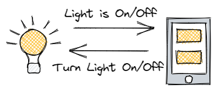
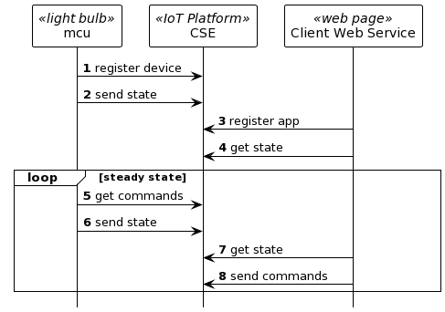

# Where Do I Start?

Developing an IoT solution can easily become an overwhelming task. This is especially true for IoT solutions that consist of many stakeholders and requirements. Some of these considerations are described in this presentation  -> Link to ETSI presentation.

These short recipes are going to describe how to implement a scalable IoT solution using the **oneM2M** standard. But before considerations related to **oneM2M** are taken into account you should first have an understanding of what your solution needs. 

## 1. Define your Solution

I think it is reasonable to state that all IoT solutions have the following components: 
- devices that measure/detect something or actuators that control something
- application or service that uses the information from the devices

With this as your starting point, it becomes fairly easy to identify the requirements of your overall solution. As a simple example that we can extend for many of the oneM2M recipes that follow let's consider a *Smart Light*. 

**Figure 1:** Example of a Smart Light solution[^1]  

## 2. Light Bulb Component
The implementation of a light can be achieved in a variety of ways, but for this example let's keep it as minimal as possible. Our light will have two states; ON and OFF. From our description above we know that we need the light to do two things:

- Report the current state of the light
- Get commands and change the state according to the commands

At this point there is enough information to build the smart light bulb. You can find a variety of sample solutions on the internet. 

1. At startup the device will set the light based on default behavior (or optionally the last state that it was in prior to shutdown). As part of this startup process the device should report the state that it is in upon completion of the start up process.
2. The steady state loop of the device should be waiting for a command to change the state of the light. When a command is received the change in state is reported.

## 3. Application for the Light
Smart solutions are generally labeled *smart* when they have some remote functionality associated with the device, such as the remote monitoring and control of a light bulb. To keep this introduction simple and to allow additional features to be added in later recipes our application will do just two things:

- Get the state of the light (and show it in some manner)
- Send commands to change the state of the light

As with the light bulb device, this contains enough information to build a basic application. The developer can use any framework desired to build this application and can target any platform for the application. 
1. At startup, after creating the desired user interface appropriate for the target platform, the application should should show the current state of the light bulb.
2. The steady state loop of the application has two responsibilities. First it should monitor the state of the light bulb and keep the UI syncronized. Second it should send commands to change the state of the light based on input from the user of the application.

# Developing the IoT Solution 

The key message that is relevant to a solution based on **oneM2M** is that whatever decisions you make regarding the implementation of the light bulb will have little effect on decisions made for the application. This is demonstrated in some of the non-basic recipes. 

# What Makes this Scalable?

At this point in the design, using a simple scenario of controlling one smart light bulb, it is difficult the demonstrate the benefit of one IoT platform versus any other IoT platform. However, as you progress through some of the other recipes you will see that you are able to add new features and capabilities to your applications without changing the device implementations. This is really important in scenarios where you have many device deployed and you want to offer smarter or more efficient services to your customers. It also allows us to leverage existing devices to create more sharing of data, more innovative applications and services, and more sustainable deployments.

**Figure 2:** Callflow of a Smart Light solution[^1]  

# What Next?

The rest of the Basic recipes will introduce the terminology and  concepts in **oneM2M** that we will use to build the scenario we just described. Then we will update this smart light bulb scenario using **oneM2M** terminology and provide a working example.

[^1]: Source: Bob Flynn

