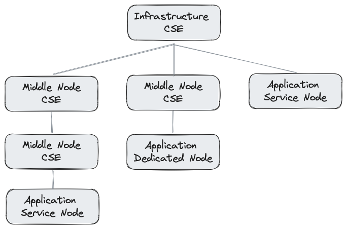

# What is a CSE?

A CSE, short for *Common Services Entity*, is a software component in a oneM2M-based IoT system that hosts one or many **Common Service Functions**, or *CSF*. Those functions represent the building blocks of an IoT system and include:

- storing of IoT data
- enabling communication between IoT entities
- security functions like identification, authentication, and authorization
- subscribing and notification
- grouping, location, semantics, and many more

As mentioned before a CSE usually contains a subset of all the available functions. This depends on the implementation and the deployment in a oneM2M infrastructure. 

  
**Figure 1:** Example of a oneM2M deployment infrastructure[^1]

[^1]: Source: Andreas Kraft

CSE's come as three different types:

- **Infrastructure CSE**, or *IN-CSE*: oneM2M defines the deployment as a tree of CSE's. At the root of this tree there is always an *Infrastructure CSE*, which may have some special rights and obligations, such as managing IoT devices (called *nodes*) and other CSE's in the tree.  
  One special property of an IN-CSE is that it has, as the root of the infrastructure tree, no further parent. It may, however be responsible to communicate the IN-CSE's from other oneM2M infrastructures.
- **Middle Node CSE**, or *MN-CSE*: This CSE type is located anywhere at the nodes below the root of the infrastructure tree. It is usually hosted on a gateway type of device, and may be responsible for a tree branch's IoT data.  
  There may be any number and any level of MN-CSE's, ie. an MN-CSE may have further children in the tree that are MN-CSE's as well.
- **Application Service Node CSE**, or *ASN-CSE*: This CSE is only located on the leaves of the oneM2M deployment tree and will have not further child nodes. They are usually installed on oneM2M-enabled devices which do have the requirement to provide some IoT services to the application(s) running on those devices. Usually, the number of services provided by these CSE's is more limited than those of a MN-CSE or IN-CSE.

There is one further node type defined by oneM2M that doesn't host a CSE at all, which is the **Application Dedicated Node**, or *ADN*. An ADN can only connect and communicate with an MN-CSE or an IN-CSE.
