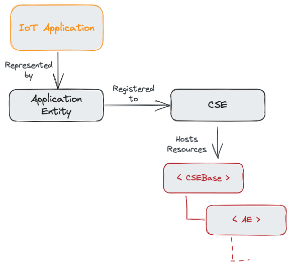

# What is an AE?

An *Application Entity*, or *AE*, is a software component in a oneM2M-based IoT system that represents an *application* on an IoT device or a oneM2M node. An AE could be a simple sensor application on a constraint device, a complex IoT application doing data analytics that runs on a gateway or in the cloud, or even an application that mediates between different IoT systems. 

It is important to understand that an AE is not the application itself, but a representation of the application in a oneM2M system.

An AE needs to be registered to a oneM2M CSE in order to be able to use the services provided by the CSE. This is necessary to enable the CSE to identify the *AE* to allow later access to the CSE's services and resources. The registration can be done either by the AE itself, or by another AE that is responsible for the management of many AEs in a business context. 

  
**Figure 1:** Basic relations of an AE in a oneM2M system[^1]

[^1]: Source: Andreas Kraft

Once registered, the AE is represented in a oneM2M system by a *Resource* of type *&lt;AE>* that is located directly under the root of the CSE's resource tree. This Resource contains all the necessary information to identify and manage the AE. This includes the AE's name, the AE's ID, an application type, and many more. 

After the successful registration the actual IoT application the can now start to build up its own resource tree under its &lt;AE> resource to store its IoT data and to use use the CSE's services.
