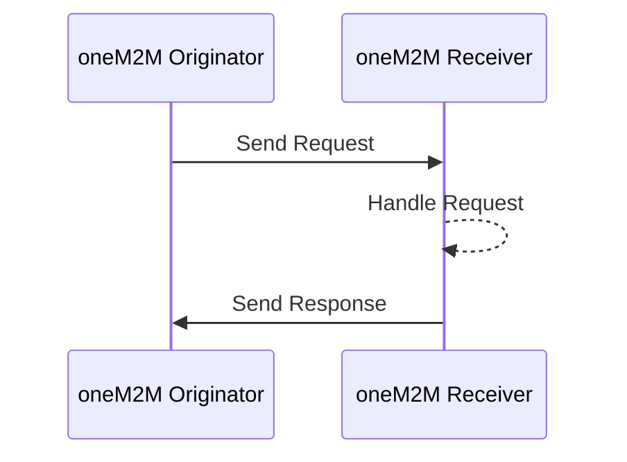

# Mapping oneM2M Requests and Responses to HTTP

oneM2M defines a set of RESTful operations that can be used to access and manipulate resources in a oneM2M CSE. For the HTTP protocol these operations are mapped to HTTP methods and are described in the following table.

| oneM2M Operation | HTTP Method | Description                        |
|:-----------------|:------------|:-----------------------------------|
| CREATE           | POST        | Create a new resource              |
| RETRIEVE         | GET         | Retrieve a resource                |
| UPDATE           | PUT         | Update a resource                  |
| DELETE           | DELETE      | Delete a resource                  |
| NOTIFY           | POST        | Notify an AE, a CSE, or a resource |

### Mappings

A oneM2M request contains *request parameters* and an optional *primitive content*. The *request paramaters* are mapped to either URL arguments or to HTTP header fields. The `from` request parameter, for example, is mapped to the `X-M2M-Origin` header while the `resultcontent` (`rcn`) request parameter is added to the URL as an argument.  
The request's  `to` parameter is mapped to the path of the URL and the actual `primitiveContent` of a oneM2M request is put into an HTTP request's body.

See the oneM2M Technical Specification [TS-0009 - HTTP Protocol Binding](https://onem2m.org/technical/published-specifications) for detailed mapping descriptions.

### Request Flow

All oneM2M requests follow a simple request/response flow:




## Requests

The following examples show how to map oneM2M requests to HTTP requests.

> **Note**
>
> In the examples we use a oneM2M &lt;container> resource with the resource name `myCnt` in the CSE base `cse-in`.  
They use the *originator* `CAdmin` and the *request ID* `123` for all requests. In a real application,
the *originator* should be the originator of the request, ie. an AE, and the *request ID* should be unique.  
The requested release version is `4`.  
The CSE runs on the local port `8080`.


### CREATE Request

This example shows how to create a new `<container>` resource in the CSE base `cse-in` with the resource name `myCnt`.

=== "oneM2M Request"

	**Request**
	
	```JSON
	{	
		"op": 1,              // CREATE
		"to": "cse-in",       // Target
		"fr": "CAdmin",       // Originator
		"rqi": "123",         // Request ID
		"rvi": "4",           // Specification version
		"ty": 3,              // Type
		"pc": {               // Primitive Content
			"m2m:cnt": {      // Container
				"rn": "myCnt" // Resource Name
			}
		}
	}
	```
	
	**Response**
	
	```JSON
	{	
		"rsc": 2001,          // Response Status Code
		"to": "CAdmin",       // Originator
		"fr": "cse-in",       // Target
		"rqi": "123",         // Request ID
		"rvi": "4",           // Specification version
		"pc": {               // Primitive Content
			"m2m:cnt": {
				"ty": 3,                           // Type
				"rn": "myCnt", 				       // Resource Name
				"pi": "id-in",                     // Parent ID
				"ri": "cnt3513897367629275974",    // Resource ID
				"ct": "20231105T141843,152179",    // Creation Time
				"lt": "20231105T141843,152179",    // Last Modified Time
				"et": "20281103T141843,161230",    // Expiration Time
				"cni": 0,  					       // Current Number of Instances
				"cbs": 0,  					       // Current Byte Size
				"st": 0 						   // State Tag
			}
		}
	}
	```


=== "HTTP Request"

	**Request**
	
	```http
	
	POST /cse-in HTTP/1.1
	Accept: application/json
	Content-Type: application/json;ty=3
	X-M2M-Origin: CAdmin
	X-M2M-RI: 123
	X-M2M-RVI: 4
	
	{ 
		"m2m:cnt": {
			"rn": "myCnt"          
		}
	}
	```
	
	Note, that the *Content-Type* `ty` parameter is set to `3` to indicate that the content is a `<container>` resource.
	
	**Response**
	
	```http
	HTTP/1.1 201 Created
	Content-Type: application/json
	X-M2M-RSC: 2001
	X-M2M-RI: 123
	X-M2M-RVI: 4
	
	{
		"m2m:cnt": {
			"rn": "myCnt",
			"ri": "cnt3513897367629275974", 
			"ct": "20231105T141843,152179", 
			"lt": "20231105T141843,152179", 
			"et": "20281103T141843,161230",
			"pi": "id-in", 
			"ty": 3, 
			"cni": 0, 
			"cbs": 0, 
			"st": 0
		}
	}
	```

=== "CURL"

	```bash
	curl \
	-X POST \
	-H 'Accept:application/json' \
	-H 'Content-Type:application/json;ty=3' \
	-H 'X-M2M-Origin:CAdmin' \
	-H 'X-M2M-RI:123' \
	-H 'X-M2M-RVI:4' \
	-d '{ "m2m:cnt" : { "rn" : "myCnt" }}' \
	http://localhost:8080/cse-in
	```

=== "HTTPie"

	```bash
	http POST http://localhost:8080/cse-in \
	'Accept:application/json' \
	'Content-Type:application/json;ty=3' \
	'X-M2M-Origin:CAdmin' \
	'X-M2M-RI:123' \
	'X-M2M-RVI:4' \
	--raw '{"m2m:cnt": {"rn": "myCnt"}}'
	```


### RETRIEVE Request

This example shows how to retrieve the `<container>` resource with the resource name `myCnt` in the CSE base `cse-in`.

=== "oneM2M Request"

	**Request**
	
	```JSON
	{	"op": 2,              // RETRIEVE
		"to": "cse-in/myCnt", // Target
		"fr": "CAdmin",       // Originator
		"rqi": "123",         // Request ID
		"rvi": "4",           // Specification version
		"ty": 3,              // Type
		"rcn": 1              // Result Content
	}
	```
	
	**Response**
	
	```JSON
	{	
		"rsc": 2000,          // Response Status Code
		"to": "CAdmin",       // Originator
		"fr": "cse-in",       // Target
		"rqi": "123",         // Request ID
		"rvi": "4",           // Specification version
		"pc": {               // Primitive Content
			"m2m:cnt": {
				"ty": 3,                           // Type
				"rn": "myCnt", 				       // Resource Name
				"pi": "id-in",                     // Parent ID
				"ri": "cnt3513897367629275974",    // Resource ID
				"ct": "20231105T141843,152179",    // Creation Time
				"lt": "20231105T141843,152179",    // Last Modified Time
				"et": "20281103T141843,161230",    // Expiration Time
				"cni": 0,  					       // Current Number of Instances
				"cbs": 0,  					       // Current Byte Size
				"st": 0 						   // State Tag
			}
		}
	}
	```

=== "HTTP Request"

	**Request**
	
	```http
	GET /cse-in/myCnt?rcn=1 HTTP/1.1
	Accept: application/json
	X-M2M-Origin: CAdmin
	X-M2M-RI: 123
	X-M2M-RVI: 4
	```
	
	**Response**
	
	```http
	HTTP/1.1 200 OK
	Content-Type: application/json
	X-M2M-RSC: 2000
	X-M2M-RI: 123
	X-M2M-RVI: 4
	
	{
		"m2m:cnt": {
			"rn": "myCnt",
			"ri": "cnt3513897367629275974", 
			"ct": "20231105T141843,152179", 
			"lt": "20231105T141843,152179", 
			"et": "20281103T141843,161230",
			"pi": "id-in", 
			"ty": 3, 
			"cni": 0, 
			"cbs": 0, 
			"st": 0
		}
	}
	```

=== "CURL"

	```bash
	curl \
	-X GET \
	-H 'Accept:application/json' \
	-H 'X-M2M-Origin:CAdmin' \
	-H 'X-M2M-RI:123' \
	-H 'X-M2M-RVI:4' \
	http://localhost:8080/cse-in/myCnt?rcn=1
	```

=== "HTTPie"

	```bash
	http GET http://localhost:8080/cse-in/myCnt?rcn=1 \
	'Accept:application/json' \
	'X-M2M-Origin:CAdmin' \
	'X-M2M-RI:123' \
	'X-M2M-RVI:4'
	```


### UPDATE Request

This example shows how to update the `<container>` resource with the resource name `myCnt` in the CSE base `cse-in`.

=== "oneM2M Request"

	**Request**
	
	```JSON
	{	
		"op": 3,              // UPDATE
		"to": "cse-in/myCnt", // Target
		"fr": "CAdmin",       // Originator
		"rqi": "123",         // Request ID
		"rvi": "4",           // Specification version
		"ty": 3,              // Type
		"pc": {               // Primitive Content
			"m2m:cnt": {      // Container
				"lbl": [      // Labels
					"aLabel"
				]
			}
		}
	}
	```
	
	**Response**
	
	```JSON
	{	
		"rsc": 2004,          // Response Status Code
		"to": "CAdmin",       // Originator
		"fr": "cse-in",       // Target
		"rqi": "123",         // Request ID
		"rvi": "4",           // Specification version
		"pc": {               // Primitive Content
			"m2m:cnt": {
				"ty": 3,                           // Type
				"rn": "myCnt", 				       // Resource Name
				"pi": "id-in",                     // Parent ID
				"ri": "cnt3513897367629275974",    // Resource ID
				"ct": "20231105T141843,152179",    // Creation Time
				"lt": "20231105T141843,152179",    // Last Modified Time
				"et": "20281103T141843,161230",    // Expiration Time
				"cni": 0,  					       // Current Number of Instances
				"cbs": 0,  					       // Current Byte Size
				"st": 0, 						   // State Tag
				"lbl": ["aLabel"]                  // Labels
			}
		}
	}
	```

=== "HTTP Request"

	**Request**
	
	```http
	PUT /cse-in/myCnt HTTP/1.1
	Accept: application/json
	Content-Type: application/json
	X-M2M-Origin: CAdmin
	X-M2M-RI: 123
	X-M2M-RVI: 4
	
	{
		"m2m:cnt": {
			"lbl": ["aLabel"]
		}
	}
	```
	
	**Response**
	
	```http
	HTTP/1.1 200 OK
	Content-Type: application/json
	X-M2M-RSC: 2004
	X-M2M-RI: 123
	X-M2M-RVI: 4
	
	{
		"m2m:cnt": {
			"rn": "myCnt",
			"ri": "cnt3513897367629275974", 
			"ct": "20231105T141843,152179", 
			"lt": "20231105T141843,152179", 
			"et": "20281103T141843,161230",
			"pi": "id-in", 
			"ty": 3, 
			"cni": 0, 
			"cbs": 0, 
			"st": 0,
			"lbl": ["aLabel"]
		}
	}
	```

=== "CURL"

	```bash
	curl \
	-X PUT \
	-H 'Accept:application/json' \
	-H 'Content-Type:application/json' \
	-H 'X-M2M-Origin:CAdmin' \
	-H 'X-M2M-RI:123' \
	-H 'X-M2M-RVI:4' \
	-d '{ "m2m:cnt": { "lbl": ["aLabel"] }}' \
	http://localhost:8080/cse-in/myCnt
	```

=== "HTTPie"

	```bash
	http PUT http://localhost:8080/cse-in/myCnt \
	'Accept:application/json' \
	'Content-Type:application/json' \
	'X-M2M-Origin:CAdmin' \
	'X-M2M-RI:123' \
	'X-M2M-RVI:4' \
	--raw '{"m2m:cnt": {"lbl": ["aLabel"]}}'
	```


### DELETE Request

This example shows how to delete the `<container>` resource with the resource name `myCnt` in the CSE base `cse-in`.

=== "oneM2M Request"

	**Request**
	
	```JSON
	{	
		"op": 4,              // DELETE
		"to": "cse-in/myCnt", // Target
		"fr": "CAdmin",       // Originator
		"rqi": "123",         // Request ID
		"rvi": "4",           // Specification version
		"ty": 3               // Type
	}
	```
	
	**Response**
	
	```JSON
	{	
		"rsc": 2002,          // Response Status Code
		"to": "CAdmin",       // Originator
		"fr": "cse-in",       // Target
		"rqi": "123",         // Request ID
		"rvi": "4"            // Specification version
	}
	```

=== "HTTP Request"

	**Request**
	
	```http
	DELETE /cse-in/myCnt HTTP/1.1
	Accept: application/json
	X-M2M-Origin: CAdmin
	X-M2M-RI: 123
	X-M2M-RVI: 4
	```
	
	**Response**
	
	```http
	HTTP/1.1 200 OK
	Content-Type: application/json
	X-M2M-RSC: 2002
	X-M2M-RI: 123
	X-M2M-RVI: 4
	```

=== "CURL"

	```bash
	curl \
	-X DELETE \
	-H 'Accept:application/json' \
	-H 'X-M2M-Origin:CAdmin' \
	-H 'X-M2M-RI:123' \
	-H 'X-M2M-RVI:4' \
	http://localhost:8080/cse-in/myCnt
	```

=== "HTTPie"

	```bash
	http DELETE http://localhost:8080/cse-in/myCnt \
	'Accept:application/json' \
	'X-M2M-Origin:CAdmin' \
	'X-M2M-RI:123' \
	'X-M2M-RVI:4'
	```


​	

## Summary

This article showed how oneM2M requests map to HTTP requests. Further details can be found in the oneM2M Technical Specification [TS-0009 - HTTP Protocol Binding](https://onem2m.org/technical/published-specifications).


---
<span style="color:grey">*by Andreas Kraft, 2023-11-05*</span>
