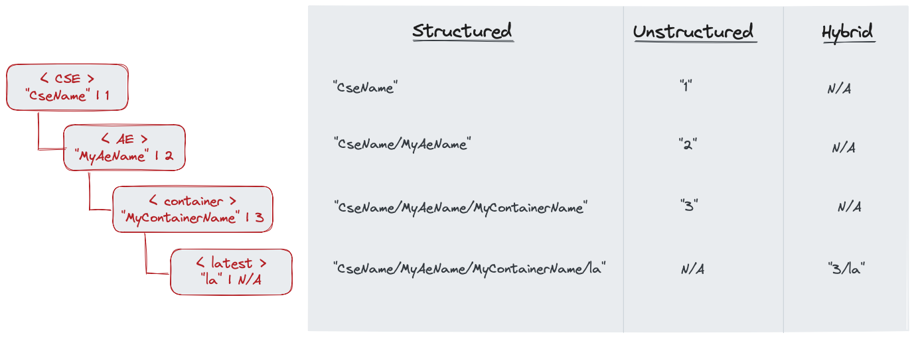

# What are Structured and Unstructured Resource Addresses?

Addressing resources in oneM2M can be done in different ways. oneM2M defines three formats that can be used for addressing resources and in resource IDs:

- **structured**: Identifiers that use the *structured* format look like a path in a file system. The path elements are constructed from the *resource names* of the resources in a CSE's resource tree. Using this format it is also possible to address resources where the *resource identifier* is unknown.  
Example: `CseName/MyAeName/MyContainerName` 
- **unstructured**: The *unstructured* format is used to directly address a resource where the *resource identifier* is known. Sometimes it is simpler to use this format. Also, the identifier is a bit shorter which may be important in when communicating over constrained communication channels. In general, a CSE is using *unstructured* references to address resources.
    Example: `MyContainerID`
- **hybrid**: The *hybrid* format is is a combination of the *unstructured* and *structured* formats and used only to address virtual resources while using also the *unstructured* format. This is necessary because virtual resources only have a *resource name*, but no *resource identifier*. While virtual resources can be easily addressed using the path-like *structured* format, the *unstructured* format is therefore not available here.  
    An address in *hybrid* format has two elements: The *unstructured* resource ID of the virtual resource's parent, and the *resource name* of the virtual resource.
    Example: `MyContainerID/la` - this addresses the *&lt;latest>* resource of a parent *&lt;container>* resource with the *resource identifier* "MyContainerID".

**Figure 1**: Address format examples[^1]

[^1]: Author: Andreas Kraft

An Application Entity (AE) might choose to use any of these formats to address resources in a oneM2M system. 

Read more about addressing resources in a distributed CSE deployment and see more examples in [Resource Identifier Scopes and Formats](Resource-Identifier-Scopes-and-Formats.md).

---
*by Andreas Kraft, 2023-08-08*
